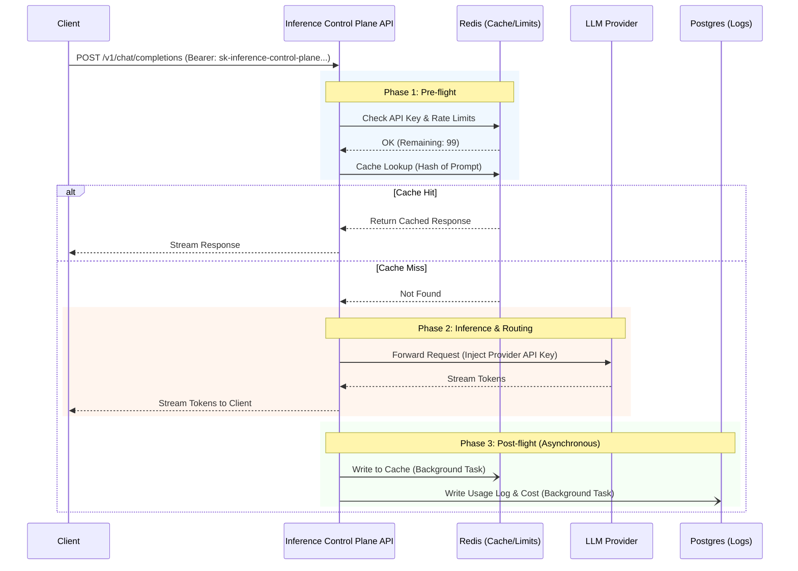

# System Architecture

Inference Control Plane is designed as a high-throughput, low-latency API gateway that sits securely between your applications and various AI foundational models. It is built on a modern, asynchronous Python stack to handle thousands of concurrent streaming connections efficiently.

## Core Components

The architecture consists of four primary components:

1. **The Proxy API (Python/FastAPI):** The heart of Inference Control Plane. It handles incoming HTTP requests, performs authentication, enforces rate limits, queries the cache, routes the request to the upstream provider, and streams the response back.
2. **Transactional Database (PostgreSQL):** The system of record. It stores Tenants, Users, API Keys, Routing Policies, and historical Usage Logs (tokens, latency, cost).
3. **In-Memory Datastore (Redis):** Handles transient, high-velocity data. It manages rate-limiting sliding windows, exact-match prompt caching, and short-lived configuration caching to prevent database bottlenecks.
4. **The Dashboard (Next.js):** The administrative interface for visualizing metrics and managing configurations. It communicates with the Proxy API via a set of administrative endpoints.

---

## Request Lifecycle (The Critical Path)

When a client application makes a request to Inference Control Plane, it goes through a strict pipeline designed to add less than 3 milliseconds of overhead.

### Phase 1: Pre-flight (Synchronous)
1. **Authentication:** The `sk-inference-control-plane` key is validated. To ensure sub-millisecond validation, API keys are cached in Redis.
2. **Rate Limiting:** A Redis Lua script atomically checks and increments the sliding window for the tenant/user. If the limit is exceeded, a `429 Too Many Requests` is returned instantly.
3. **Cache Lookup:** The prompt is hashed. Redis is queried for an exact match. (If semantic caching is enabled, a vector DB is queried).

### Phase 2: Inference & Routing (Synchronous)
1. **Policy Evaluation:** Inference Control Plane determines the primary model and fallback chain based on the tenant's configuration or request headers.
2. **Execution:** Using an asynchronous HTTP client (`httpx.AsyncClient` with connection pooling), the request is forwarded to the provider (e.g., OpenAI).
3. **Streaming:** As the provider streams tokens back, Inference Control Plane immediately yields them to the client connection, ensuring zero perceived latency overhead during generation.

### Phase 3: Post-flight (Asynchronous)
Once the client connection is closed (the request is complete):
1. **Usage Aggregation:** Tokens, latency, and estimated cost are calculated.
2. **Persistence:** The data is pushed to an asynchronous background task queue within FastAPI, which flushes the logs to PostgreSQL. This ensures that database write latency never impacts the client's TTFT (Time To First Token).

---

## Deployment Architecture

Inference Control Plane is container-native and designed to be deployed horizontally.

### Single Region (Standard)
In a standard deployment, you run multiple identical instances of the `inference-api` container behind a load balancer. They share a single PostgreSQL database and a single Redis instance/cluster. Because all state is stored in Redis/Postgres, the API containers are completely stateless and can be scaled up or down based on CPU or memory usage.

### Multi-Region (Enterprise)
For globally distributed applications, Inference Control Plane can be deployed across multiple geographic regions to reduce latency.
- **API Nodes & Redis:** Deployed in every region close to the users.
- **PostgreSQL:** A primary instance in a central region handles writes (configuration changes, usage logs), while read-replicas in edge regions handle administrative queries.

## Extensibility & Scaling Model

- **Connection Management:** Because AI requests can take tens of seconds, standard synchronous Python web servers block quickly. Inference Control Plane uses ASGI (Uvicorn) and `asyncio`, allowing a single API worker to handle thousands of concurrent long-lived streaming connections without thread exhaustion.
- **Database Pooling:** We utilize `asyncpg` for non-blocking Postgres access. In high-throughput environments, a connection pooler like PgBouncer should be placed in front of PostgreSQL to prevent connection limits from being reached.
