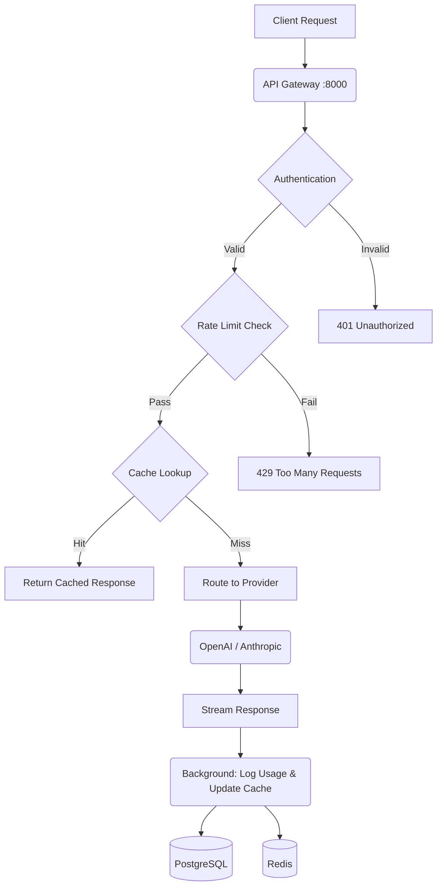

```mermaid
graph TD
    A[Client Request] --> B(API Gateway :8000);
    B --> C{Authentication};
    C -- Valid --> D{Rate Limit Check};
    C -- Invalid --> E[401 Unauthorized];
    D -- Pass --> F{Cache Lookup};
    D -- Fail --> G[429 Too Many Requests];
    F -- Hit --> H[Return Cached Response];
    F -- Miss --> I[Route to Provider];
    I --> J(OpenAI / Anthropic);
    J --> K[Stream Response];
    K --> L(Background: Log Usage & Update Cache);
    L --> M[(PostgreSQL)];
    L --> N[(Redis)];
```
