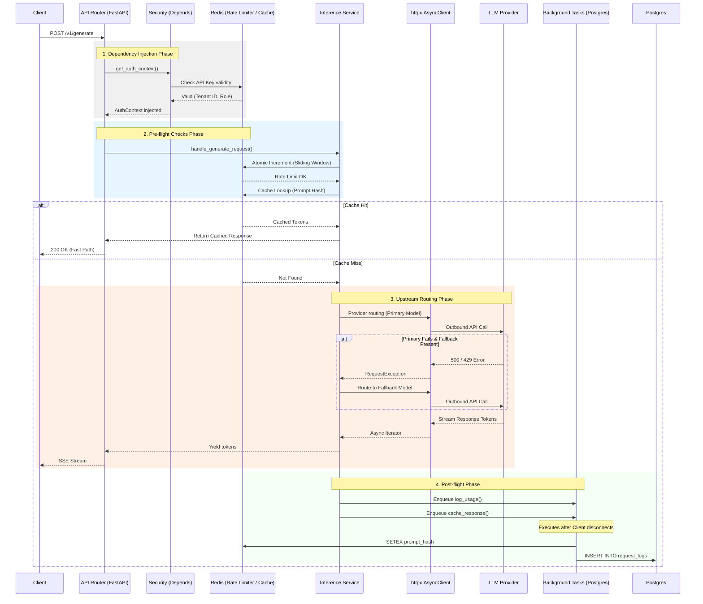

# Project Internals & Execution Flow

This document provides a deep dive into the internal mechanics of the Inference Control Plane gateway. Understanding these internals is essential for debugging, performance tuning, and contributing to the core repository.

## Execution Pipeline

The core application is an asynchronous FastAPI web service. Every inference request follows a highly optimized execution pipeline designed to minimize blocking operations.

### Request Flow Diagram

## Architectural Design Decisions

### 1. Asynchronous I/O (`asyncio`)
Given that calls to external LLM providers can take anywhere from a few milliseconds to several minutes, a traditional synchronous WSGI worker model (like standard Gunicorn/Flask) would quickly experience thread starvation. By leveraging ASGI (Uvicorn) and fully asynchronous I/O (`httpx`, `asyncpg`, `redis.asyncio`), a single API node can maintain thousands of concurrent upstream connections while using minimal memory.

### 2. Lifespan Connection Pooling
Opening and closing TCP connections and completing TLS handshakes for every request adds significant overhead. The FastAPI `lifespan` context manager is used to initialize shared, global connection pools on startup:
- `httpx.AsyncClient`: Used for all outbound provider requests.
- `asyncpg.create_pool()`: Manages PostgreSQL database connections efficiently.
- `redis.asyncio.Redis`: Shared Redis connection pool.

### 3. Background Tasks for Non-Critical Path Work
Writing usage logs to PostgreSQL and persisting items into the Redis cache are inherently blocking (at the network level) and do not need to delay the time it takes for a user to see their response.
These actions are dispatched to FastAPI's `BackgroundTasks`, executing immediately *after* the HTTP response has been returned and the connection closed.

### 4. Custom Error Handlers
To prevent data leakage and operational blind spots:
- `RequestValidationError`: Overridden to strip potentially malicious raw input from 422 responses while logging it locally.
- Global `Exception`: Caught unhandled exceptions are logged with full stack traces (`exc_info=True`) locally, but a sanitized generic `500 Internal Server Error` is returned to the client.
