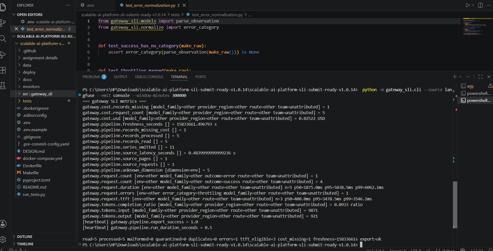
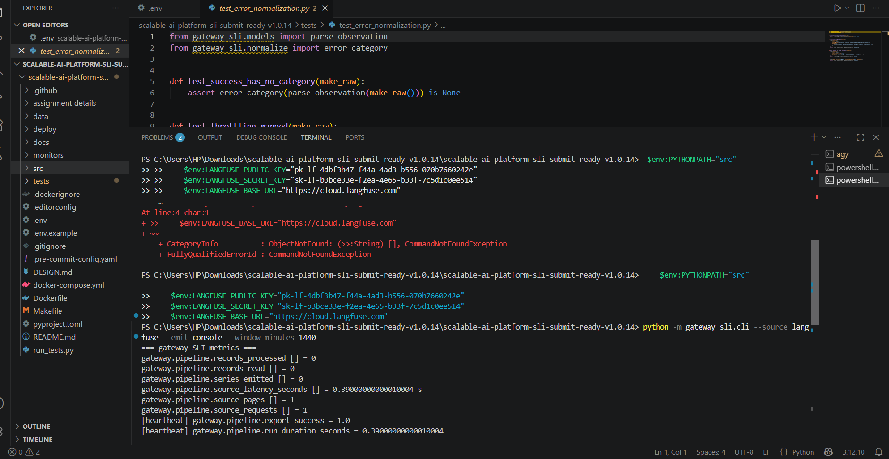
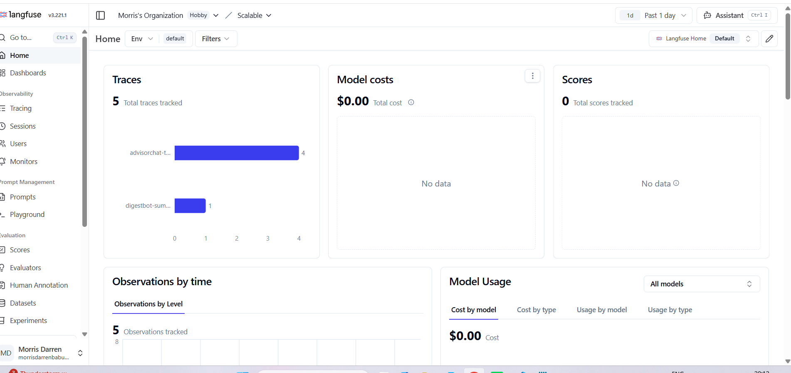
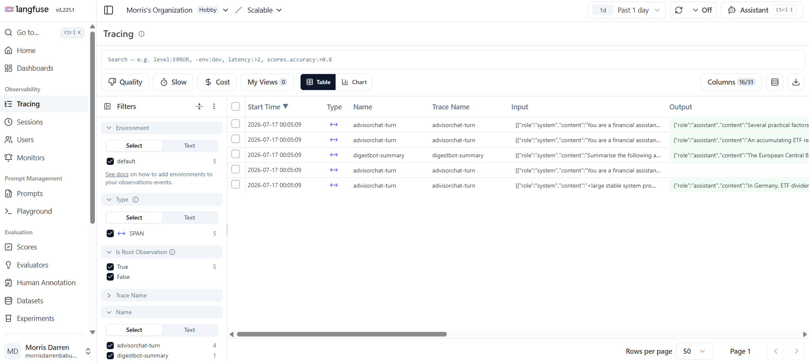

# gateway-sli: Langfuse-to-SLI service (Task 2, Option D)


-blue)


<p align="center">
  
</p>

Privacy-safe, bounded-cardinality operational SLIs for an LLM gateway, derived from
Langfuse request-level traces.

> **What this is / isn't.** This repository implements **only Option D**. The
> platform design (Options A/B/C, cost governance, data governance, model sourcing)
> lives in [`DESIGN.md`](DESIGN.md); the target-state diagrams live in
> [`docs/architecture.md`](docs/architecture.md). Nothing deferred is described here
> as implemented. The data-driven **evidence base** for every design decision is in
> [`DATA_ANALYSIS.md`](docs/DATA_ANALYSIS.md) (findings F1-F11, each traceable to a number
> in the supplied data). Detailed metric derivations, cardinality math, and operating
> semantics live in [`DESIGN_APPENDIX.md`](docs/DESIGN_APPENDIX.md).

## Problem statement

A single LiteLLM gateway serves six workloads across Bedrock (Frankfurt) and one
external ZDR provider. Langfuse (Postgres + ClickHouse) already stores full traces
for debugging. What's missing is a **metrics** plane: latency, reliability, cost, and
a lightweight quality signal for dashboards, SLOs, and alerts, **without** copying
prompts/outputs/PII into Datadog and **without** a second trace store.

## What goes in and what comes out

This is **not another LLM gateway**. LiteLLM is the gateway. This repository contains
a scheduled observability job that reads traces produced by that gateway.

There are two interchangeable input modes:

- `data/sample_traces.json` is a fixed Langfuse export supplied with the case study.
  It lets anyone run and test the job without credentials. Each run processes the
  records in that file.
- `data/demo_runaway_traces.json` keeps the supplied fixture intact and adds one
  clearly marked synthetic DevAgent observation. Its completion-to-input ratio is
  4.2, so the runnable example crosses the monitor threshold of 3.
- `--source langfuse` reads the same kind of observations from the Langfuse API.
  In normal operation the job requests only a recent closed time window. The
  checkpoint remembers completed windows, and a short overlap catches late arrivals
  without counting ordinary re-reads twice.

The job does not change or resend the original traces. It derives aggregate metrics
such as latency histograms, TTFT, request and error counts, cost, token ratios, and
pipeline-health signals. Console output is useful for local checks. OTLP/HTTP output
is the production path to an OpenTelemetry Collector and then Datadog.

Past traces are useful for a one-time backfill, validating metric definitions, and
building an initial quality baseline. After that, scheduled runs process new closed
windows. Raw prompts and responses remain in Langfuse; only governed aggregates leave
the job.

## Scope

- **Implemented:** end-to-end pipeline `read → structural privacy projection/parse (quarantine) → dedup → aggregate
  → quality + telemetry-trust self-metrics → metric-schema guard → export`, over a
  deterministic **file source** (Langfuse export fixture); OTLP/JSON and console
  exporters; a **Metric Governance Contract** registry (single source of truth for
  every dimension); **Telemetry Trust Contract** self-metrics (completeness, freshness,
  duplicate/malformed/quarantine/missing-cost rates, export health, cardinality
  health); streaming bounded-memory histograms; in-batch idempotency; a per-window
  completion-length anomaly (count + max-magnitude gauge); config validation;
  monitors-as-code (incl. **multi-window burn-rate** pair); full test suite (including governance-contract, cache-economics, cross-run checkpoint/idempotency, dirty-data resilience, runaway-agent detection, and property/fuzz invariants).
- **Two live source/sink adapters (transport-injected, unit-tested):**
  `LangfuseApiTraceSource` implements the **Observations API** contract
  (`GET /api/public/observations?type=GENERATION`, `fromStartTime`/`toStartTime`
  closed-window bounding, cursor/page pagination, Basic auth, 429 backoff) and
  `OtlpHttpExporter` **transmits** the OTLP/JSON payload to `<endpoint>/v1/metrics`.
  Both inject their HTTP transport so the wire contract is verified deterministically
  without a live endpoint (default transport is stdlib `urllib`). We aggregate raw
  observations rather than using Langfuse's server-side Metrics API so privacy
  projection and cardinality governance happen inside our boundary.
- **Not in this repo:** Options A/B/C, a rolling anomaly baseline store, and
  pointing the adapters at live production endpoints. Cross-run checkpoint +
  watermark persistence with cross-run idempotency **is implemented** (local
  single-writer file store and production DynamoDB conditional-write store). See **Implemented vs
  Recommendation vs Deferred** below.

## Why Option D

My Inference Control Plane addressed *control* of LLM traffic (routing, caching,
rate limiting, token optimization, audit). Option D adds the **operational layer to
run that gateway reliably**: it turns Langfuse traces into privacy-safe, bounded SLIs.
Control decisions (Option B budgets, Option A guardrails) are only trustworthy if you
can measure their effect. That is the job of this component. It also demonstrates the judgment the
brief asks for (privacy as structure, correct percentiles, honest failure handling)
in a small, complete, defensible surface.

## Architecture & data flow

```
Langfuse/ClickHouse (source of truth)
        │  (bounded-window read; dotted path in docs/architecture.md)
        ▼
  TraceSource  ──  file fixture (implemented) | Langfuse API (adapter)
        ▼
  parse_observation      PRIVACY BOUNDARY: validate + discard raw content/IDs
        ▼
  dedup                  reject missing IDs; in-window + checkpoint overlap
        ▼
  aggregate              histograms (latency/TTFT) + counters (count/errors/cost/tokens)
        ▼
  quality + trust        completion-length anomaly + pipeline self-metrics (TTC)
        ▼
  metric schema guard     name/type/unit/dimensions + governed values
        ▼
  Exporter               OTLP/JSON (guarded)  |  console
        ▼
  OpenTelemetry / Datadog (aggregate metrics only)
```

Full diagram, zones, and the trace-vs-metric boundary: [`docs/architecture.md`](docs/architecture.md).

## Relationship to the larger platform

The service is **off the request hot path**. It reads a bounded, delayed window of
traces on a schedule, derives aggregates, and emits metrics. A failure in the service
degrades observability only. It never blocks user traffic (fail-safe; see Failure behavior).

## Local setup

Requires Python 3.11+. The core pipeline has no third-party runtime dependencies; the production DynamoDB checkpoint extra installs `boto3`. Dev tools are pytest/ruff/mypy.

```bash
# from the repo root
python -m venv .venv

# Activate the virtual environment:
source .venv/bin/activate      # Unix/macOS
# .venv\Scripts\activate       # Windows

pip install -e ".[dev]"        # installs pytest, ruff, mypy
```

## Exact commands

```bash
# Run the pipeline on the fixture, human-readable output.
# --window-end anchors the window just after the fixture's newest trace so freshness
# reads like a live run; omit it in production and the window ends at "now".
python -m gateway_sli.cli --source data/sample_traces.json --emit console \
    --window-end 2026-01-15T11:46:00Z

# Emit OTLP/JSON to stdout (or a file with --otel-out out.otlp.json):
python -m gateway_sli.cli --source data/sample_traces.json --emit otel \
    --window-end 2026-01-15T11:46:00Z

# Cross-run watermark + idempotency: resume from the last committed watermark
# (minus --overlap-minutes) and de-duplicate traces re-read in the overlap.
python -m gateway_sli.cli --source data/sample_traces.json --emit console \
    --checkpoint ./state/checkpoint.json --overlap-minutes 10
```

## Run the flagship runaway demo

The supplied trace fixture contains AdvisorChat and DigestBot only. The spend CSV,
not the trace fixture, is the evidence for the DevAgent finding. To make that finding
visible in a runnable example without changing the supplied artifact, run:

```bash
python -m gateway_sli.cli \
  --source data/demo_runaway_traces.json \
  --emit console \
  --window-end 2026-01-15T11:46:00Z
```

The output includes:

```text
gateway.tokens.completion_ratio [model_family=gpt-5 provider_region=external_zdr route=devagent-task team=DevAgent] = 4.2 ratio
```

That value is above the checked-in Datadog monitor threshold of 3. The extra record is
synthetic and labelled as such. `data/sample_traces.json` remains byte-for-byte equal
to the file supplied with the case study.

## Test commands

```bash
pytest -q                     # canonical suite (pythonpath=src is set in pyproject)
ruff check . && mypy src      # lint + type-check
```

> **Offline note.** If your environment has no network/PyPI and pytest cannot be
> installed, `python run_tests.py` executes the *same* test functions with a tiny
> zero-dependency runner. It exists only for air-gapped verification; `pytest` is the
> canonical entry point. The runner is also exercised in CI and must pass the complete suite.

## Example output (real run on `data/sample_traces.json`, 5 records)

```
=== gateway SLI metrics ===
gateway.cache.hit_count [model_family=claude-sonnet provider_region=bedrock_eu route=advisorchat-turn team=AdvisorChat] = 1
gateway.cache.read_tokens [model_family=claude-sonnet provider_region=bedrock_eu route=advisorchat-turn team=AdvisorChat] = 3812
gateway.cost.records_missing [model_family=claude-sonnet provider_region=bedrock_eu route=advisorchat-turn team=AdvisorChat] = 1
gateway.cost.request_count [model_family=claude-haiku provider_region=bedrock_eu route=digestbot-summary team=DigestBot] = 1
gateway.cost.request_count [model_family=claude-sonnet provider_region=bedrock_eu route=advisorchat-turn team=AdvisorChat] = 4
gateway.cost.usd [model_family=claude-haiku provider_region=bedrock_eu route=digestbot-summary team=DigestBot] = 0.007283 USD
gateway.cost.usd [model_family=claude-sonnet provider_region=bedrock_eu route=advisorchat-turn team=AdvisorChat] = 0.01726 USD
gateway.pipeline.freshness_seconds [] = 20.858 s
gateway.pipeline.records_missing_cost [] = 1
gateway.pipeline.records_processed [] = 5
gateway.pipeline.records_read [] = 5
gateway.pipeline.series_emitted [] = 18
gateway.request.count [env=prod model_family=claude-haiku outcome=success route=digestbot-summary team=DigestBot] = 1
gateway.request.count [env=prod model_family=claude-sonnet outcome=error route=advisorchat-turn team=AdvisorChat] = 1
gateway.request.count [env=prod model_family=claude-sonnet outcome=success route=advisorchat-turn team=AdvisorChat] = 3
gateway.request.duration [env=prod model_family=claude-haiku route=digestbot-summary team=DigestBot] n=1 p50=2500.0ms p95=2950.0ms p99=2990.0ms
gateway.request.duration [env=prod model_family=claude-sonnet route=advisorchat-turn team=AdvisorChat] n=4 p50=1750.0ms p95=9000.0ms p99=9800.0ms
gateway.request.errors [env=prod error_category=throttling model_family=claude-sonnet route=advisorchat-turn team=AdvisorChat] = 1
gateway.request.ttft [env=prod model_family=claude-sonnet route=advisorchat-turn team=AdvisorChat] n=3 p50=400.0ms p95=4700.0ms p99=4940.0ms
gateway.tokens.input [model_family=claude-haiku provider_region=bedrock_eu route=digestbot-summary team=DigestBot] = 8214
gateway.tokens.input [model_family=claude-sonnet provider_region=bedrock_eu route=advisorchat-turn team=AdvisorChat] = 1657
gateway.tokens.output [model_family=claude-haiku provider_region=bedrock_eu route=digestbot-summary team=DigestBot] = 178
gateway.tokens.output [model_family=claude-sonnet provider_region=bedrock_eu route=advisorchat-turn team=AdvisorChat] = 743
[heartbeat] gateway.pipeline.export_success = 1.0

read=5 processed=5 malformed=0 quarantined=0 duplicates=0 errors=1 ttft_eligible=3 cost_missing=1 freshness=21s export=ok
```

Note `ttft_eligible=3` (not 4): the failed request is excluded from TTFT but still
counted in latency and errors. `cost_missing=1`: the error row's empty `costDetails`
is surfaced, not counted as $0. The `gateway.pipeline.*` lines are the **Telemetry
Trust Contract** self-metrics; the `gateway.cache.*` lines show cached-token volume and
cache-hit count for the one request served from cache. `freshness_seconds` is ~21s here
because `--window-end` anchors the window just after the fixture's newest trace; with the
default (`now`) against a static fixture it would be large, and against live Langfuse it
is seconds-to-minutes. Console `p50/p95/p99` are **bucket-interpolated
approximations** (hence the round values); the authoritative percentiles are computed
backend-side from the emitted histogram buckets.

## Metric catalogue

| Name | Type | Unit | Dimensions | Interpretation |
|---|---|---|---|---|
| `gateway.request.duration` | histogram | ms | team, route, model_family, env | End-to-end latency; percentiles computed backend-side from buckets |
| `gateway.request.ttft` | histogram | ms | team, route, model_family, env | Time-to-first-token; **successful streaming requests only** |
| `gateway.request.count` | counter | 1 | team, route, model_family, env, **outcome** | Request volume split success/error |
| `gateway.request.errors` | counter | 1 | team, route, model_family, env, **error_category** | Errors by bounded category |
| `gateway.cost.usd` | counter | USD | team, route, model_family, [provider_region] | Spend; absent/invalid cost excluded |
| `gateway.cost.request_count` | counter | 1 | team, route, model_family, [provider_region] | Requests contributing to cost |
| `gateway.cost.records_missing` | counter | 1 | team, route, model_family, [provider_region] | Records with absent cost |
| `gateway.cost.records_invalid` | counter | 1 | team, route, model_family, [provider_region] | Records with malformed/non-finite/negative cost |
| `gateway.tokens.input` / `.output` | counter | 1 | team, route, model_family, [provider_region] | Token volumes |
| `gateway.tokens.completion_ratio` | gauge | ratio | team, route, model_family, [provider_region] | Completion÷prompt tokens per series; runaway-agent signature (DATA_ANALYSIS.md F1); emitted only when prompt tokens > 0 |
| `gateway.cache.read_tokens` | counter | 1 | team, route, model_family, [provider_region] | Cached input tokens served; emitted only when a series had cache hits |
| `gateway.cache.hit_count` | counter | 1 | team, route, model_family, [provider_region] | Requests served cached tokens; hit ratio = this ÷ `cost.request_count` |
| `gateway.quality.completion_length_anomalies` | counter | 1 | route[, model_family] | Per-window count of completion-length outliers (robust z ≥ threshold) |
| `gateway.quality.completion_length_max_zscore` | gauge | score | route[, model_family] | Largest robust z-score magnitude in the window; only when not in cold start |
| `gateway.quality.empty_completion_count` | counter | 1 | route[, model_family] | Successful requests with zero completion tokens |
| `gateway.pipeline.records_read` | counter | 1 | (none) | Raw records read from the source (blind-spot / no-data signal) |
| `gateway.pipeline.records_processed` | counter | 1 | (none) | Records successfully parsed into observations |
| `gateway.pipeline.malformed_records` | counter | 1 | (none) | Schema-invalid records (missing ID, bad/missing timestamps, end<start) |
| `gateway.pipeline.quarantined_records` | counter | 1 | (none) | Records failing with an unexpected error; contained, not fatal |
| `gateway.pipeline.duplicate_records` | counter | 1 | (none) | Duplicate observation ids dropped in-batch (idempotency) |
| `gateway.pipeline.cross_run_duplicate_records` | counter | 1 | (none) | Observations already counted in a prior run's overlap window, dropped via the checkpoint (cross-run idempotency) |
| `gateway.pipeline.records_missing_cost` | counter | 1 | (none) | Processed records with absent cost |
| `gateway.pipeline.records_invalid_cost` | counter | 1 | (none) | Processed records with invalid cost |
| `gateway.pipeline.run_duration_seconds` | gauge | s | (none) | End-to-end job duration |
| `gateway.pipeline.source_requests` | counter | 1 | (none) | Langfuse HTTP attempts, including retries |
| `gateway.pipeline.source_retries` | counter | 1 | (none) | Retried transient Langfuse requests |
| `gateway.pipeline.source_pages` | counter | 1 | (none) | Successfully validated source pages |
| `gateway.pipeline.source_latency_seconds` | gauge | s | (none) | Total source-call latency |
| `gateway.pipeline.source_success` | gauge | 1 | (none) | 0 when the bounded source read cannot be completed |
| `gateway.pipeline.read_truncated` | gauge | 1 | (none) | Safety cap reached; window is incomplete and not checkpointed |
| `gateway.pipeline.clock_skew_seconds` | gauge | s | (none) | Newest record timestamp is ahead of the window end |
| `gateway.pipeline.checkpoint_conflicts` | counter | 1 | (none) | DynamoDB conditional commit lost to another worker |
| `gateway.pipeline.unknown_dimension` | counter | 1 | dimension | Values folded to `other`/`unattributed`, per governed dimension |
| `gateway.pipeline.freshness_seconds` | gauge | s | (none) | Lag between window end and newest observation processed |
| `gateway.pipeline.series_emitted` | gauge | 1 | (none) | Distinct workload series this window (cardinality health) |
| `gateway.pipeline.export_success` | gauge | 1 | (none) | 1 if the window exported cleanly, 0 on export failure |

## Telemetry Trust Contract (the signature guarantee)

Workload SLIs are only actionable if the telemetry pipeline itself is trustworthy: a
green dashboard produced from a stalled, lossy, or partially-exported pipeline is worse
than no dashboard. This service therefore treats **its own trustworthiness as a
first-class SLI**, emitted every run under `gateway.pipeline.*`:

- **Completeness:** `records_read`, `records_processed`, `records_missing_cost`,
  `malformed_records`, `quarantined_records`, `duplicate_records`.
- **Freshness / blind spot:** `freshness_seconds`, plus a `records_read` no-data signal
  so silence pages instead of masquerading as health.
- **Export health:** `export_success` (export is guarded; a failing collector can
  never crash the batch).
- **Cardinality health:** `series_emitted`, a per-window tripwire against dimension
  explosion. It counts *this window's* distinct workload series, not cumulative
  cross-window cardinality; authoritative cardinality health is backend-side (e.g.
  Datadog's cardinality explorer / Metrics without Limits).

The paired **meta-monitors** live in [`monitors/`](monitors/) as declarative Datadog
definitions (validated by `tests/test_monitors.py`, intentionally not applied from the repo).

**Scope of "completeness."** These signals measure the trust of *this pipeline's own
processing*: records it read, parsed, dropped, and exported. They cannot by themselves
prove *end-to-end* completeness (records the gateway produced but Langfuse never ingested,
or that we never fetched). Closing that loop needs reconciliation against an independent
source: the finance spend export (`data/spend_30d.csv`) is exactly such a source, so
comparing Langfuse-derived cost/volume against finance is the end-to-end completeness
check. That reconciliation is documented here and in [the design appendix](docs/DESIGN_APPENDIX.md); automating it is Deferred.

## Metric Governance Contract

Every exported dimension is declared once in `governance.py` with an explicit **owner,
bounded vocabulary, normalization policy, privacy classification, cardinality budget,
and unknown-value behavior** (full table in [the cardinality appendix](docs/DESIGN_APPENDIX.md#c-cardinality-budget---exact-derivation)). The allowlist enforced at the
export boundary and the config defaults are *derived* from this registry. There is no
second, hand-maintained list to drift. `unknown_dimension` makes every fold-to-`other`
observable, and `test_governance.py` / `test_fuzz_invariants.py` fail if any normalizer
emits a value outside its declared vocabulary or if worst-case cardinality exceeds the
budget. This turns "we don't leak and we don't explode cardinality" from a claim into an
enforced, tested contract.

## Privacy guarantees

1. Metric dimensions can only be produced by normalizers in `normalize.py` into a
   frozen `PrimaryDims`; nothing else reaches aggregation keys.
2. `emit/base.py::assert_allowed` independently rejects any point whose attribute keys
   are outside the governance-derived allowlist `{team, route, model_family, env,
   outcome, error_category, provider_region, dimension}` before export.
3. The internal `Observation` type cannot represent prompts, outputs, status messages,
   trace/request ids, tags, or arbitrary error objects; those fields are discarded at parsing.
4. Tests prove a planted PII marker never appears in the serialized OTLP payload and
   that an injected disallowed attribute is rejected.

## Cardinality guarantees

Every dimension is a bounded, enumerated allowlist; unknown values fold into `other`
(so a typo, a casing variant, or an id-bearing trace name can never mint a new series):

- `team`: matched case-insensitively against a known-team allowlist (`config.py`);
  blank → `unattributed`, unknown → `other`.
- `route`: shape-validated *and* checked against a known-route allowlist; unknown →
  `other`. Open route vocabularies are rejected; every production route must be registered.
- `model_family` and `error_category`: explicit maps; unknown → `other`/`unknown`.
- `provider_region`: explicit bounded mapping (`bedrock_eu`, `external_zdr`, ...);
  arbitrary values are **not** parsed out of `internalModelId`.
- `dimension`: meta-key on pipeline self-metrics only; its values are the governed
  dimension names above (bounded).

All of the above are declared once in the **Metric Governance Contract** registry
(`governance.py`); the export allowlist and config defaults are *derived* from it, so
there is no second list to drift. `emit/base.py::assert_allowed` independently rejects
any point whose metric name/type/unit/dimension set or attribute key/value falls outside the registry, and
`gateway.pipeline.unknown_dimension` makes every fold-to-`other` observable. Worst-case
series count is the product of small enums (`estimated_max_series()`, see [the cardinality appendix](docs/DESIGN_APPENDIX.md#c-cardinality-budget---exact-derivation))
and is asserted by a property/fuzz test. No user/request/prompt-derived labels exist.

## Failure behavior

| Condition | Behavior |
|---|---|
| Malformed record (bad/missing timestamps, `endTime < startTime`) | Skipped; counted in `gateway.pipeline.malformed_records`; batch continues |
| Missing cost | Excluded from `cost.usd`; counted in `cost.records_missing` (never $0) |
| Malformed/non-finite/negative cost | Excluded from `cost.usd`; counted separately in `cost.records_invalid` |
| Failed request | Counted in latency + errors; **excluded** from TTFT |
| Non-streaming / missing `completionStartTime` | Excluded from TTFT (not recorded as 0) |
| Unexpected error on a single record | **Quarantined** (contained), counted in `gateway.pipeline.quarantined_records`; window continues |
| Empty window | No workload points, but **`records_read=0` is emitted** so a blind spot is alertable (tested) |
| Anomaly baseline below `min_sample` | Cold start: no anomaly emitted (no fabricated signal) |
| MAD = 0 | Handled explicitly: mean-abs-dev fallback, then constant-baseline rule |
| Export failure (collector down) | Guarded: `export_success=0`, `stats.export_ok=False`, non-zero exit; batch never crashes |
| Source unavailable/incomplete | Off the hot path; **fail-safe**: do not export workload metrics or checkpoint; emit failure health; never block traffic |
| Missing observation ID | Reject as `missing_observation_id`; do not create non-idempotent DELTA metrics |

## Assumptions

- Langfuse export matches the fixture schema in `data/sample_traces.json`.
- The daily spend export (`data/spend_30d.csv`, analyzed in `docs/DATA_ANALYSIS.md`) is stale by up
  to ~24h and cannot drive real-time enforcement.
- Percentiles are aggregated backend-side from histogram buckets (see Trade-offs).

## Trade-offs

- **Histograms, not per-instance percentiles.** Emitting pre-computed percentiles per
  instance and averaging them downstream is statistically wrong. We accumulate explicit
  buckets in **streaming, bounded memory** (O(buckets), independent of trace volume) and
  emit them so Datadog computes correct percentiles across instances. The trade-off is
  choosing bucket boundaries (`config.py`). The console's local p50/p95/p99 are
  **bucket-interpolated approximations**; the authoritative percentiles are backend-side.
- **Batch, not streaming.** A scheduled windowed batch (with a grace delay for
  late/updated traces) is simpler and correct for SLIs; it trades sub-second freshness
  for operational simplicity and idempotency.
- **File source fully built, API source as adapter.** Deterministic, testable now;
  honest about what isn't wired.

## What is implemented and what is not

**Implemented:** file and Langfuse API sources, streaming aggregation, privacy and
metric-schema guards, OTLP/JSON and OTLP/HTTP export, governed dimensions, Datadog
monitor definitions, local and DynamoDB checkpoints, overlap de-duplication, and the
CLI. These paths are covered by unit, adversarial, and end-to-end tests.

**Recommended next:** connect the adapters to staging, add near-real-time gateway cost
counters, and tune the supplied monitors with production traffic.

**Deferred:** a persisted quality baseline, corrective deltas for observations that
change after a window closes, and Options A, B, and C. (Bounded memory performance is proven via the `test_benchmark.py` memory stress test).

## Known limitations

- Anomaly detection is cold-start on small windows by design; it needs a persisted
  rolling baseline per route to be operationally useful (Deferred).
- The Langfuse API source implements pagination, Basic auth, windowing, and 429
  backoff against an injected transport (unit-tested). The default transport is
  stdlib `urllib` and has been fully verified against the live Langfuse Cloud. Cross-run checkpoint/watermark persistence is also implemented.
- The `OtlpHttpExporter` transmits the OTLP/JSON payload to `<endpoint>/v1/metrics`
  (also transport-injected and unit-tested), and `export_success` is sent on a
  separate heartbeat call; task/no-data monitoring remains the independent failure signal. The exporter already has a request deadline and bounded retries. Durable queueing
  and downstream backpressure remain the collector's responsibility. This take-home
  has not been pointed at a live production collector.
- Local console percentiles are bucket-interpolated approximations; exact percentiles
  are computed backend-side from the emitted buckets.
- Cross-run de-duplication is implemented via the checkpoint store: a record
  re-observed in a later run's overlap window is de-duplicated across runs. The
  local JSON store is single-writer/development-only; the included DynamoDB store
  uses conditional version writes for production concurrency. Corrective-delta
  re-emission for observations that are *updated* after a window closes (versus
  merely re-read) remains the honest remaining gap.
- `series_emitted` reflects per-window series count, not cumulative cross-window
  cardinality; the authoritative cardinality trend lives backend-side.
- The completion-length anomaly uses a normal-scaled robust z-score; token-length
  distributions are typically right-skewed, so it is intentionally investigation-only.
  A log transform, persisted rolling baseline, or empirical per-route quantiles would refine it (future work).

## Next steps

1. Point `LangfuseApiTraceSource` at a live Langfuse instance (the request/
   pagination/backoff contract is implemented and unit-tested against an injected
   transport), and use the included DynamoDB checkpoint store for multi-writer-safe conditional commits.
2. Add a rolling per-route baseline store for the anomaly signal.
3. Point `OtlpHttpExporter` at a production collector. Validate and tune the existing
   timeout and retry settings against that environment.
4. Wire near-real-time gateway cost counters at the proxy for sub-window spend.

## Run against a live Langfuse instance

The CLI reads from a sample file by default. To pull real traces from Langfuse, pass `--source langfuse` and set the credentials and either supported host variable:

```bash
export LANGFUSE_HOST=https://cloud.langfuse.com   # LANGFUSE_BASE_URL is also accepted
export LANGFUSE_PUBLIC_KEY=pk-lf-...
export LANGFUSE_SECRET_KEY=sk-lf-...

python -m gateway_sli.cli --source langfuse --emit otlp-http \
  --otlp-endpoint http://localhost:4318 --window-minutes 60
```

If the keys are missing the CLI exits with a clear error naming the variables it still needs. `OTEL_DEPLOYMENT_ENVIRONMENT` is added as a `deployment.environment` resource attribute on every exported metric.

## Proof of Execution

The following screenshots demonstrate the pipeline executing successfully, connecting to external sources, and passing all tests:









