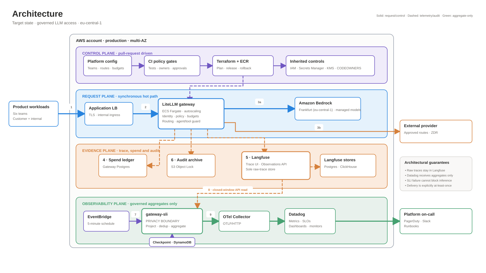

# Architecture

This document separates the **request plane**, the **scheduled projection plane**, and
the **metric plane**. The key privacy fact is that raw Langfuse observations exist only
in the fetch step's transient memory. `parse_observation` immediately converts each raw
record into an `Observation` type that cannot represent prompts, outputs, status
messages, trace/request IDs, tags, or arbitrary error objects.

## Principal architecture view



The editable source is [`architecture.drawio`](architecture.drawio). It contains two
pages:

1. **Architecture:** a C4-style deployment view showing the control plane, AWS account,
   VPC, runtime services, providers, stores, trust boundaries, and operational path.
2. **SLI run sequence:** the read, projection, export, failure, and checkpoint sequence.

The diagram uses service names rather than AWS product icons. This keeps it readable in
GitHub, print, and draw.io while preserving the details that matter in an architecture
review: ownership, deployment boundary, data classification, failure isolation,
delivery semantics, and the direction of each data flow.

### How to read the numbered paths

1. Product workloads send authenticated requests through the internal ALB.
2. LiteLLM authenticates the workload and applies route policy.
3. Provider policy selects Bedrock Frankfurt or an explicitly approved ZDR route.
4. A bounded accounting event updates the gateway spend ledger.
5. Request-level trace, usage, and cost data go to Langfuse, the sole raw-trace store.
6. Policy and tool decisions go to the immutable audit archive.
7. EventBridge starts the off-path `gateway-sli` task.
8. The task reads a bounded closed Langfuse window and projects raw observations into a
   privacy-safe type before aggregation.
9. Only schema-governed aggregate metrics cross into OTel and Datadog.

Solid lines represent synchronous request or control flow. Dashed lines represent
asynchronous telemetry, audit, deployment, or checkpoint activity. Green marks the
aggregate-only monitoring boundary. Orange marks the **PRIVACY BOUNDARY** and paths where
raw trace or audit data can exist. Purple marks control and state-management paths.

## One-run correctness sequence

```mermaid
sequenceDiagram
    autonumber
    participant E as EventBridge
    participant J as gateway-sli
    participant C as DynamoDB checkpoint
    participant L as Langfuse API
    participant O as OTel collector

    E->>J: Start scheduled task
    J->>C: Load watermark + bounded seen IDs
    C-->>J: Versioned checkpoint
    loop Bounded pages, bounded retries
        J->>L: GET closed window page
        L-->>J: GENERATION observations
        Note over J: Parse removes content/IDs except observation ID;<br/>missing IDs fail closed; aggregate in bounded memory
    end
    alt Source incomplete or truncated
        J-->>J: Emit/return failure health
        Note over J,C: Do not advance watermark
    else Complete source read
        J->>O: POST governed DELTA metrics
        alt Export accepted and heartbeat accepted
            J->>C: Conditional checkpoint commit
            alt Version conflict
                C-->>J: Conflict; exit non-zero
                Note over J,O: Delivery remains explicitly at-least-once
            else Commit succeeds
                C-->>J: New watermark durable
            end
        else Export fails
            Note over J,C: Do not advance watermark; retry overlap next run
        end
    end
```

The sequence stays inline as Mermaid. It renders directly in GitHub and remains easy
to edit during future changes.

## Trust boundaries and data classification

| Boundary / zone | Data allowed | Enforcement |
|---|---|---|
| Request plane | Prompts, outputs, PII, provider responses, trace IDs | Workload identity, provider/region policy, encryption, retention |
| Fetch step | One bounded raw API page in transient process memory | Page/window limits, timeout/retry limits, no raw persistence or logging |
| `parse_observation` | Crossing point from raw record to safe internal type | Sensitive fields are discarded; error objects reduce to a bounded marker |
| Aggregation and quality | Safe timestamps, bounded dimensions, token/cost numbers, observation ID for dedup | Normalizers, missing-ID rejection, bounded accumulators/reservoirs |
| Metric export | Aggregate metric points only | Full metric registry validates name, type, unit, dimension set, key and value |
| Checkpoint | Watermark plus observation ID → end timestamp for overlap only | DynamoDB conditional version write; overlap pruning; no content |

## Implemented, recommended, and deliberately not claimed

- **Implemented:** Langfuse API and file sources; structural privacy projection;
  streaming aggregation; strict metric governance; OTLP/HTTP delivery; source/export
  health; fail-closed pagination; local and DynamoDB checkpoints; in-window and
  cross-run deduplication; checked-in monitors.
- **Recommended target-state addition:** independent spend-ledger reconciliation
  (`LEDGER → TRUST`) to detect traces that never reached Langfuse.
- **Not claimed:** atomic exactly-once export plus checkpoint. Export can succeed before
  a checkpoint conflict is detected, so delivery is explicitly **at-least-once**.
  Corrective deltas for observations changed after first processing also remain deferred.

## Why these boundaries matter

The SLI job is outside the inference path, so its failure cannot block customer traffic.
The privacy boundary occurs **before aggregation**, not merely at the exporter. The
exporter then validates the entire metric shape as defense in depth. Pipeline health
ends at a human-visible monitor: stale, incomplete, or failed telemetry is treated as
an operational blind spot rather than as a healthy empty dashboard.
